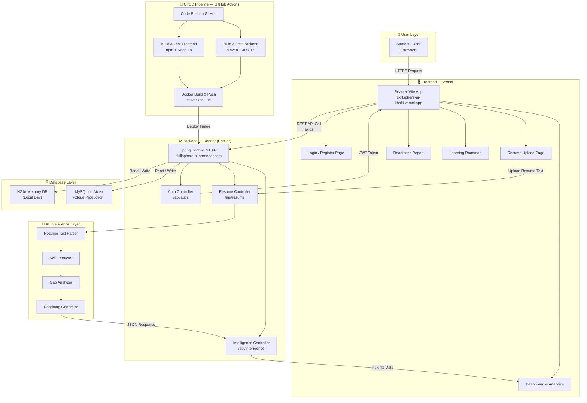

# SkillSphere AI — System Architecture

## Full Project Workflow

---

## Layer-by-Layer Breakdown

| Layer | Technology | Responsibility |
|---|---|---|
| **User** | Browser (Any device) | Interacts with the web app |
| **Frontend** | React + Vite → Vercel | UI, routing, API calls |
| **Backend** | Spring Boot → Render | REST APIs, business logic, auth |
| **AI Layer** | Java (Custom NLP) | Parses resume, extracts skills, generates roadmap |
| **Database** | H2 (local) / MySQL Aiven (cloud) | Stores users, resumes, sessions |
| **CI/CD** | GitHub Actions | Auto build, test, and push Docker image on every commit |
| **Containers** | Docker + Docker Hub | Packages the backend into a portable image |
